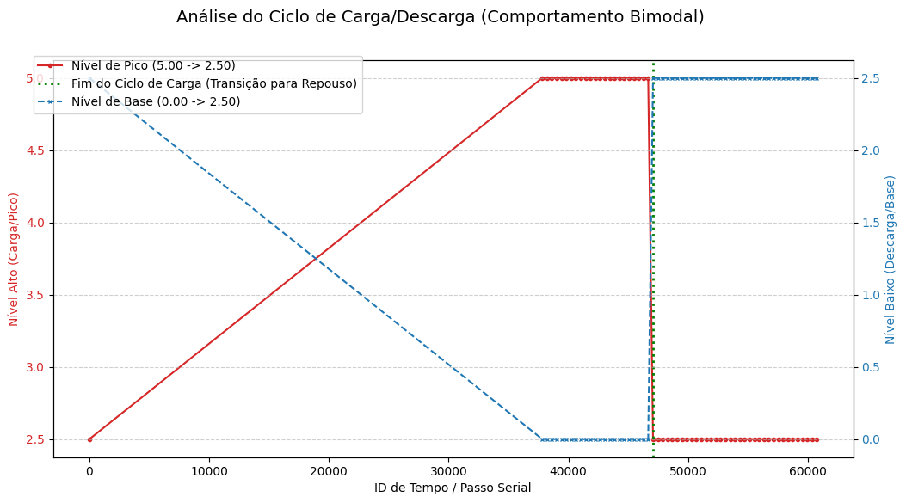
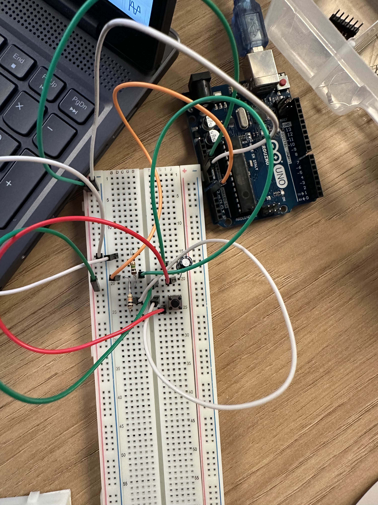

# Ponderada IOT 2
Imagem do circuito RC feito no TinkerCad:


Esse circuito mostra como um capacitor carrega e
descarrega ao longo do tempo, o Arduino está lendo
essa variação de tensão no capacitor (via uma
entrada analógica).

Codigo do circuito RC:

``` 
int pinoNoRC=0;
int valorLido = 0;
float tensaoCapacitor = 0, tensaoResistor;
unsigned long time;
void setup(){
Serial.begin(9600);
}
void loop() {
time=millis();
valorLido=analogRead(pinoNoRC);
tensaoResistor=(valorLido*5.0/1023); // 5.0V / 1023 degraus = 0.0048876
tensaoCapacitor = abs(5.0-tensaoResistor);
Serial.print(time); //imprime o conteúdo de time no MONITOR SERIAL
Serial.print(" ");
Serial.print(tensaoResistor);
Serial.print(" ");
Serial.println(tensaoCapacitor);
delay(400);
}
```
Aqui esta o Codigo gerado para os graficos:
```
import pandas as pd
import matplotlib.pyplot as plt
import seaborn as sns
import io

# --- 1. PREPARAÇÃO DOS DADOS ---

# Seus dados em formato de string
dados_serial_str = """
10 2.50 2.50
37813 0.00 5.00
38215 0.00 5.00
38618 0.00 5.00
39020 0.00 5.00
39422 0.00 5.00
39824 0.00 5.00
40226 0.00 5.00
40629 0.00 5.00
41031 0.00 5.00
41434 0.00 5.00
41836 0.00 5.00
42238 0.00 5.00
42640 0.00 5.00
43042 0.00 5.00
43445 0.00 5.00
43847 0.00 5.00
44250 0.00 5.00
44652 0.00 5.00
45053 0.00 5.00
45456 0.00 5.00
45858 0.00 5.00
46261 0.00 5.00
46663 0.00 5.00
47066 2.50 2.50
47468 2.50 2.50
47869 2.50 2.50
48272 2.50 2.50
48674 2.50 2.50
49077 2.50 2.50
49479 2.50 2.50
49882 2.50 2.50
50284 2.50 2.50
50686 2.50 2.50
51089 2.50 2.50
51491 2.50 2.50
51894 2.50 2.50
52295 2.50 2.50
52698 2.50 2.50
53100 2.50 2.50
53502 2.50 2.50
53905 2.50 2.50
54307 2.50 2.50
54710 2.50 2.50
55112 2.50 2.50
55515 2.50 2.50
55917 2.50 2.50
56318 2.50 2.50
56721 2.50 2.50
57123 2.50 2.50
57526 2.50 2.50
57928 2.50 2.50
58331 2.50 2.50
58733 2.50 2.50
59136 2.50 2.50
59538 2.50 2.50
59940 2.50 2.50
60342 2.50 2.50
60744 2.50 2.50
"""
# Cria o DataFrame
df = pd.read_csv(io.StringIO(dados_serial_str), sep='\s+', header=None)
df.columns = ['ID_Tempo', 'Nível_Baixo', 'Nível_Alto'] # Renomeando para Carga/Descarga


# --- 2. GRÁFICO 1: CICLO COMPLETO (CARGA/DESCARGA) ---

def draw_cycle_plot(df):
    """
    Cria um gráfico de linhas mostrando os níveis de Carga/Descarga ao longo do tempo.
    O eixo Y_principal (Nível_Alto) pode ser interpretado como o pico de Carga.
    O eixo Y_secundário (Nível_Baixo) pode ser o nível de Descarga/Repouso.
    """
    
    fig, ax1 = plt.subplots(figsize=(12, 6))
    
    # Eixo Y1: Nível Alto (Pico / Carga)
    color = 'tab:red'
    ax1.set_xlabel('ID de Tempo / Passo Serial')
    ax1.set_ylabel('Nível Alto (Carga/Pico)', color=color)
    ax1.plot(df['ID_Tempo'], df['Nível_Alto'], color=color, label='Nível de Pico (5.00 -> 2.50)', marker='o', markersize=3)
    ax1.tick_params(axis='y', labelcolor=color)

    # Eixo Y2: Nível Baixo (Descarga / Repouso)
    ax2 = ax1.twinx()  # Cria um segundo eixo Y que compartilha o mesmo eixo X
    color = 'tab:blue'
    ax2.set_ylabel('Nível Baixo (Descarga/Base)', color=color)
    ax2.plot(df['ID_Tempo'], df['Nível_Baixo'], color=color, label='Nível de Base (0.00 -> 2.50)', marker='x', markersize=3, linestyle='--')
    ax2.tick_params(axis='y', labelcolor=color)

    # Marcação da Transição (Mudança de Estado)
    ponto_transicao = df[df['ID_Tempo'] >= 47066].iloc[0]['ID_Tempo']
    ax1.axvline(x=ponto_transicao, color='green', linestyle=':', linewidth=2, label='Fim do Ciclo de Carga (Transição para Repouso)')
    
    fig.suptitle('Análise do Ciclo de Carga/Descarga (Comportamento Bimodal)', fontsize=14)
    fig.legend(loc="upper left", bbox_to_anchor=(0.1,0.9))
    plt.grid(True, linestyle='--', alpha=0.6)
    plt.show()

draw_cycle_plot(df)


# --- 3. GRÁFICO 2: BAR CHART (Contagem de Ocorrências dos Estados) ---
# Este gráfico de barras mostra a frequência dos dois modos de operação (Carga/Descarga vs. Repouso)

def draw_state_frequency_plot(df):
    """Cria um gráfico de barras para mostrar a frequência dos diferentes modos de operação."""
    
    # 1. Classifica os estados
    df['Modo_Operacao'] = 'Ciclo Carga/Descarga (0.00/5.00)'
    df.loc[(df['Nível_Baixo'] == 2.50) & (df['Nível_Alto'] == 2.50), 'Modo_Operacao'] = 'Modo Repouso/Estável (2.50/2.50)'
    
    # 2. Conta a frequência
    contagem_modos = df['Modo_Operacao'].value_counts().reset_index()
    contagem_modos.columns = ['Modo de Operação', 'Contagem de Registros']
    
    plt.figure(figsize=(10, 5))
    sns.barplot(x='Modo de Operação', y='Contagem de Registros', data=contagem_modos, palette='coolwarm')
    
    plt.title('Frequência de Registros nos Modos de Operação (Carga vs. Repouso)')
    plt.xlabel('Modo de Operação')
    plt.ylabel('Contagem de Registros')
    plt.xticks(rotation=10)
    plt.tight_layout()
    plt.show()

draw_state_frequency_plot(df)
```
Aqui esta a imagem dos Graficos Gerados:




Tambem fiz a Montagem Fisica:



